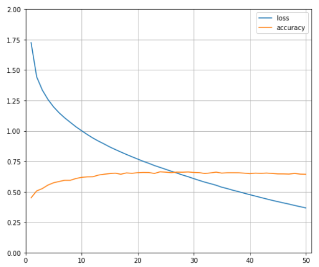

# DL2020-Labs
В примере https://pytorch.org/tutorials/beginner/blitz/cifar10_tutorial.html все уже реализовано.
Я проверил как ведит себя accuracy и loss на первых 10 эпохах обучения и оказалось что accuracy начинается с 48% и за первые 10 эпох ударяется в ~64% и выше не поднимается.

Далее я решил изменить некоторые гиперпараметры: в первом и втором сверточных слоях я сделал 8 выходных и входных каналов соответственно.
Изменил оптимизатор на Adam и скорость обучения установил равной 0.0001

График результатов обучения на 50 эпохах:

Видно что точность не поднимается выше ~66%, в то время как функция потерь продолжает уменьшаться.
Возможно, при большем количестве эпох, сеть бы переобучилать и точность заметно бы упала
