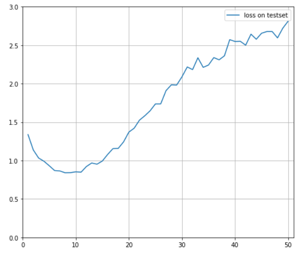
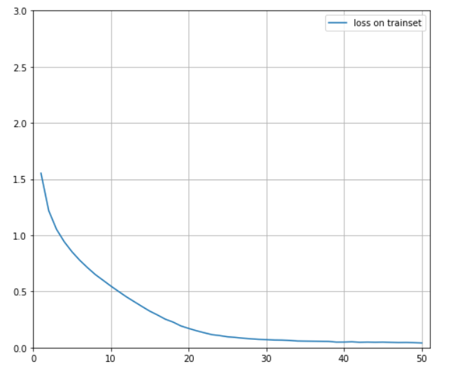
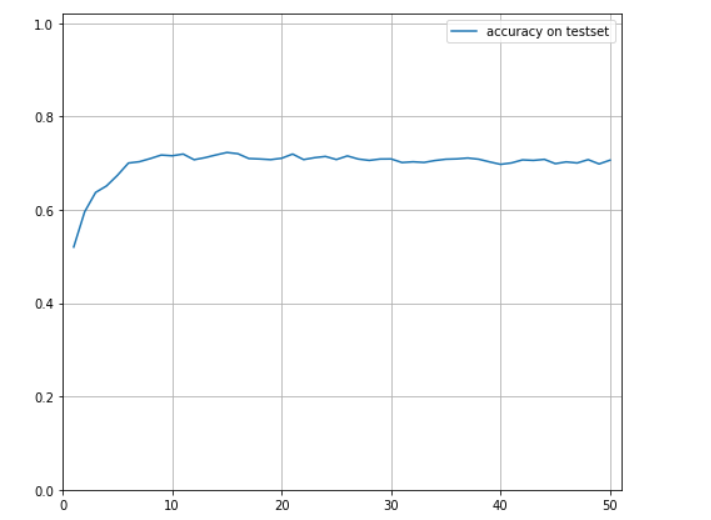
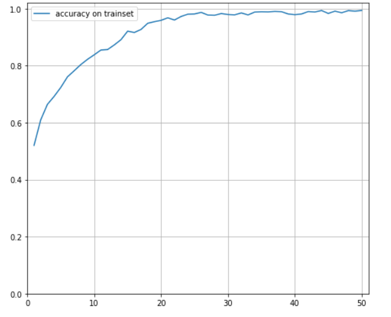

# DL2020-Labs
Архитектура нейронной сети:
1. Сверточный слой. 3 входных канала, 32 выходных. Ядро свертки = 5x5, шаг = 1.
2. Пулинг по максимальному значению с фильтром 2x2.
3. Сверточный слой. 32 входных канала, 64 выходных. Ядро свертки = 7x7, шаг = 1.
4. Пулинг по максимальному значению с фильтром 2x2.
5. Линейный слой. 1024 входа, 180 выходов.
6. Линейный слой. 180 входов, 84 выхода.
7. Линейный слой. 84 входа, 10 выходов.

Функция активации - relu.

Параметры обучения:
оптимизатор - Adam, скорость обучения = 0.0001

Графики результатов обучения на 50 эпохах:

